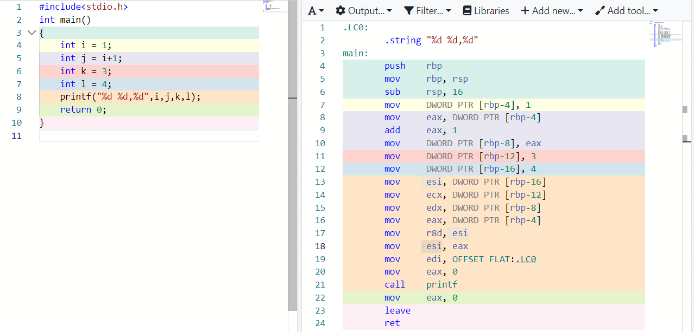

# 第二次小班课

* [ ] ppt制作
* [ ] 剧本制作
* [ ] 材料收集

### 分工 （可以把自己选择的分工写在后面）

* ppt各点内容编写：邱桥、
* 剧本编写：
* ppt排版制作配图 ：
* 大纲、材料收集汇总：wujean、邱桥

## 一、PPT制作

### ppt的大纲：

* 分点说明代码里的未定义操作有哪些
  * 展示题目
  * 指出那两个未定义操作3.1.1
* 还有哪些类似的“未定义的操作”，举例说明。
  * 3.3.1，3.3.2
* 分别说明未定义操作在不同编译器下有什么结果
  * 这个要不要写出代码，然后用不同编译器编译一下获得结果，截图进来？
  * 可以使用在https://godbolt.org/上获取不同编译器的结果
* 从汇编代码来讨论其结果不同的原因。（可在https://godbolt.org/上获取不同编译器的结果）（这个可以现场编译一下，展示汇编代码的区别？）
  * 我们要选哪几个编译器？讲多少个汇编代码？
* 未定义操作的成因3.1.2
  * 分别说明未定义操作在不同编译器下有什么结果3.2
    * 这个要不要写出代码，然后用不同编译器编译一下获得结果，截图进来？
    * 可以使用在https://godbolt.org/上获取不同编译器的结果
* 如何解决未定义操作3.1.3


## 二、剧本制作

* 一个人担任编译器来讲解正常的编译操作，栈帧结构、寄存器、一段比较简单的汇编代码（两个or三个寄存器执行指令）
* 阿巴阿巴上场，给出小班题的示例代码，在黑板上写出自己预期的执行结果。
* 编译器开始编译代码，交给寄存器来工作，寄存器吵架，编译出错
* 寄存器质问编译器为什么会允许未定义的操作，编译器来讲解未定义操作对c语言的作用
* 旁白来讲述其他可能的未定义操作
* 最后大家一起 包饺子okok 大家一起放弃c++

### 开幕

c语言编译器正在展示他强大的功能，他向大家展示了他是如何编译一段简单的汇编代码（）

<figure><figcaption></figcaption></figure>


## 三、材料收集（将收集好的材料按照二级标题分类存档）

### 3.1 小班题目相关

#### 3.1.1 该段代码中有哪些未定义行为

1. 在一个表达式中修改一个变量的值：在语句“1 \* a\[i++] + 2 \* a\[i++] + 3 \* a\[i++]”中，对于i的后缀自增操作，无法保证i的值被修改的顺序和结果，因为C语言没有规定在表达式中对变量进行的多次修改的顺序。
2. 对同一个变量进行后缀自增或后缀自减操作，并使用该变量的值：在语句“j=j++”中，j的值不能保证会被正确更新，因为C语言没有规定在同一表达式中的自增和自减操作的顺序，这个代码段实际上是未定义行为。

因此，这段代码有两个未定义行为，需要修改为确定的行为。

#### 3.1.2 为什么会出现未定义行为

在C++中，未定义行为是指当程序的行为不可预测或不符合语言规范时会发生的情况。这通常是由于程序员未正确编写程序代码或由于编译器实现不一致而导致的。

C++允许未定义行为的主要原因是为了允许编译器和运行时系统在实现时进行优化，并允许程序员利用底层硬件的细节来提高性能。例如，某些优化技术（如代码重排和死代码消除）可能会导致未定义的行为。此外，允许未定义行为还使C++能够保持简单，而不需要在语言规范中规定所有细节和行为，从而增加了语言的灵活性和可扩展性。

然而，程序员应该避免依赖于未定义的行为，因为这会导致程序不可预测、不可移植或不稳定。相反，程序员应该编写符合C++语言规范的代码，并使用良好的编程实践来确保程序的正确性和可移植性。

#### 3.1.3 如何解决这些未定义行为

(ChatGPT)要解决这些未定义行为，可以采取以下措施：

1. 读写内存时进行边界检查：在读取或写入内存时，应确保访问的内存地址在合法的范围内，即不超出数组边界。可以使用一些工具或编写代码来进行边界检查。
2. 避免对空指针解引用：在使用指针时，应先进行空指针检查，以确保指针不为空。如果指针为空，则应避免对其进行解引用操作。
3. 初始化变量：在定义变量时，应该将其初始化为一个合法的值，以避免在使用未初始化变量时出现未定义行为。
4. 避免在表达式中多次修改同一变量：在表达式中多次修改同一变量而没有使用序列点可能会导致未定义行为。可以使用逗号运算符或其他控制结构来明确执行顺序。
5. 避免多次求值同一函数参数：在函数参数列表中多次求值同一参数可能会导致未定义行为。可以使用中间变量来保存参数的值，以避免多次求值。
6. 避免有符号整数溢出：可以使用无符号整数类型，或使用溢出检查工具来避免有符号整数溢出。

总之，要解决未定义行为，需要编写健壮的代码，并进行边界检查和错误处理。在编写代码时，应该遵循最佳实践和编程规范，以确保代码的正确性和可靠性。

#### 3.1.4 编译优化

### 3.2 汇编指令相关

#### 3.2.1 汇编代码中的指令

```asm
mov     DWORD PTR [rbp-4], 0
dword   双字 就是四个字节
ptr     pointer缩写 即指针
[]里的数据是一个地址值，这个地址指向一个双字型数据
```

```
lea rax, QWORD PTR [-28+rbp]
QWORD PTR 表示操作数大小为 64 位,四字，8个字节
将相对于 rbp 的偏移量为 -28 的地址加载到寄存器 rax 中
```

#### 3.2.2 寄存器和栈帧

X86-64寄存器和栈帧

[https://blog.csdn.net/ccboby/article/details/6042380](https://blog.csdn.net/ccboby/article/details/6042380)&#x20;

[https://zhuanlan.zhihu.com/p/440016053](https://zhuanlan.zhihu.com/p/440016053)

#### 3.2.3 一段简单的汇编代码

<figure><figcaption></figcaption></figure>

这段代码是一个简单的C语言程序，使用`printf`函数打印出两个整数变量`i`和`j`的值。下面是这段代码的分析：

`.LC0: .string "i = %d,j = %d"`

`.LC0`是一个标号，表示这个字符串常量的位置，`.string`是一个汇编指令，用于在代码段中声明一个字符串常量。

`main:`

`main`是程序的主函数，程序的执行从这里开始。

```perl
push rbp
mov rbp, rsp
sub rsp, 16
```

这段汇编代码是用来设置函数栈帧的，将栈指针`rsp`向下移动16个字节，以在栈上为函数的局部变量和临时变量预留空间。同时，将旧的栈底指针`rbp`压入栈中，并将当前的栈指针`rsp`赋值给`rbp`，以便在函数退出时恢复栈指针。

```css
mov DWORD PTR [rbp-4], 0
mov eax, DWORD PTR [rbp-4]
add eax, 1
mov DWORD PTR [rbp-8], eax
```

这段汇编代码用来初始化变量`i`和`j`的值。在这里，`i`的初始值被设置为0，然后被加载到`eax`寄存器中，递增1后存储到变量`j`中（`[rbp-8]`表示从栈底指针`rbp`向下偏移8个字节的内存位置，即变量`j`的存储位置）。

```css
mov edx, DWORD PTR [rbp-8]
mov eax, DWORD PTR [rbp-4]
mov esi, eax
mov edi, OFFSET FLAT:.LC0
mov eax, 0
call printf
```

这段汇编代码调用了`printf`函数，用于输出变量`i`和`j`的值。在这里，将变量`i`和`j`的值加载到`eax`和`edx`寄存器中，并通过寄存器`esi`和`edi`将它们传递给`printf`函数。同时，将字符串常量`.LC0`的地址传递给`printf`函数，以指示要打印的格式字符串。最后，调用`printf`函数来打印格式化字符串。

```
mov eax, 0
leave
ret
```

这段汇编代码将0值加载到`eax`寄存器中，然后使用`leave`指令撤销函数栈帧，回收栈空间，并将旧的栈底指针`rbp`的值恢复到栈指针`rsp`中。最后，使用`ret`指令返回到调用者。

#### 一些值得注意的点

我们在call printf 调用该函数的时候，可能会好奇函数的参数是如何传递进该函数的；

众所周知%eax是累加器，用来存储加法的结果，故不能用于函数传值且在使用完后要进行清零操作

```
mov esi, eax
mov edi, OFFSET FLAT:.LC0
mov eax, 0
call printf
```

故在该步骤中先将eax的值传递给esi，再将eax清零

那么printf函数是如何执行的呢？

printf函数接受一系列的参数，其中第一个参数为一个字符串，根据编译器的规定

x86-64中，最多允许 6 个参数通过通用寄存器来传递，多出的参数需要通过栈来传递；传递参数时，参数的顺序与寄存器的关系对应如下：

| 操作数大小（位） | 参数1  | 参数2  | 参数3  | 参数4  | 参数5  | 参数6  |
| -------- | ---- | ---- | ---- | ---- | ---- | ---- |
| 64       | %rdi | %rsi | %rdx | %rcx | %r8  | %r9  |
| 32       | %edi | %esi | %edx | %ecx | %r8d | %r9d |
| 16       | %di  | %si  | %dx  | %cx  | %r8w | %r9w |
| 8        | %dil | %sil | %dl  | %cl  | %r8b | %r9b |

当参数大于 6 个时，把超出的参数放到栈上，而参数 7 位于栈顶。

我们可以看到在调用printf函数前编译器给各个寄存器分别赋了值，这个赋值是按照一定的顺序的：

```
mov edx, DWORD PTR [rbp-8]
mov eax, DWORD PTR [rbp-4]
mov esi, eax
mov edi, OFFSET FLAT:.LC0
mov eax, 0
call printf
```

### 3.3 未定义操作相关

**3.3.1 一些常见的未定义行为包括：**

* 读取或写入超出数组边界范围的内存。
* 对空指针进行解引用。
* 在函数中使用未初始化的变量。
* 在表达式中多次修改同一变量而没有使用序列点。
* 在函数参数列表中多次对同一参数求值。
* 有符号整数溢出：当有符号整数类型发生溢出时，结果是未定义的[\[2\]](https://c-cpp.com/c/language/behavior)。

(perplexity.ai)在C语言中，有许多未定义的操作。以下是一些常见的未定义行为：

* 1\. 数组越界：当程序试图访问数组元素时，如果下标超出了数组的范围，则会发生未定义行为[\[1\]](https://www.hiczp.com/c-cpp/c-yu-yan-chang-jian-wei-ding-yi-hang-wei.html)[\[2\]](https://c-cpp.com/c/language/behavior)[\[3\]](https://www.nowcoder.com/questionTerminal/8e273aeb2b4147fea72ff08814fc78e6)。
* 2\. 在表达式中修改变量并且没有指定顺序：例如 \`j=j++\` 这样的代码也是未定义的[\[1\]](https://www.hiczp.com/c-cpp/c-yu-yan-chang-jian-wei-ding-yi-hang-wei.html)[\[2\]](https://c-cpp.com/c/language/behavior)。
* 3\. 使用空指针或释放已经释放过的指针：这些都是未定义行为，可能导致程序崩溃或者产生其他错误[\[1\]](https://www.hiczp.com/c-cpp/c-yu-yan-chang-jian-wei-ding-yi-hang-wei.html)[\[3\]](https://www.nowcoder.com/questionTerminal/8e273aeb2b4147fea72ff08814fc78e6)。
* 4\. 对于没有初始化的变量进行读取操作：这个行为也是未定义的，因为它依赖于编译器和运行时环境[\[1\]](https://www.hiczp.com/c-cpp/c-yu-yan-chang-jian-wei-ding-yi-hang-wei.html)。
* 5\. 有符号整数溢出：当有符号整数类型发生溢出时，结果是未定义的[\[2\]](https://c-cpp.com/c/language/behavior)。
* 需要注意的是，在不同编译器上或者不同操作系统或者不同架构CPU上会产生不同结果。因此，在编写 C 代码时应该尽量避免使用未定义行为，并且要注意不同编译器之间可能存在差异。
  * 5 SOURCESView List1hiczp2c-cpp3nowcoder4csdn5juejin

<!---->

* [ ] 来个人用相关的例子把这里给填满

**3.3.2 例子**

```c
//读取或写入超出数组边界范围的内存。
int arr[5] = {1, 2, 3, 4, 5};
int x = arr[10]; // 超出数组下标范围

// 解引用空指针
int *p = NULL;
int x = *p; 
int *q = malloc(sizeof(int));

// 释放已经释放过的指针
free(q);
free(q); 

//在函数中使用未初始化的变量。
int x;
int y = x;

//在表达式中多次修改同一变量而没有使用序列点。
int x = 5;
int y = ++x + ++x;  // 未使用序列点

// 发生有符号整数溢出
int i = INT_MAX;
i = i + 1; 

//在函数参数列表中多次对同一参数求值。
int square(int x) {
    return x * x;
}

int func(int a, int b, int c) {
    int result = square(a++) + square(++b) + square(c);
    return result;
}

int main() {
    int x = 2;
    int y = func(x, x, x);
    return 0;
}
```

### 3.4 拓展阅读相关
